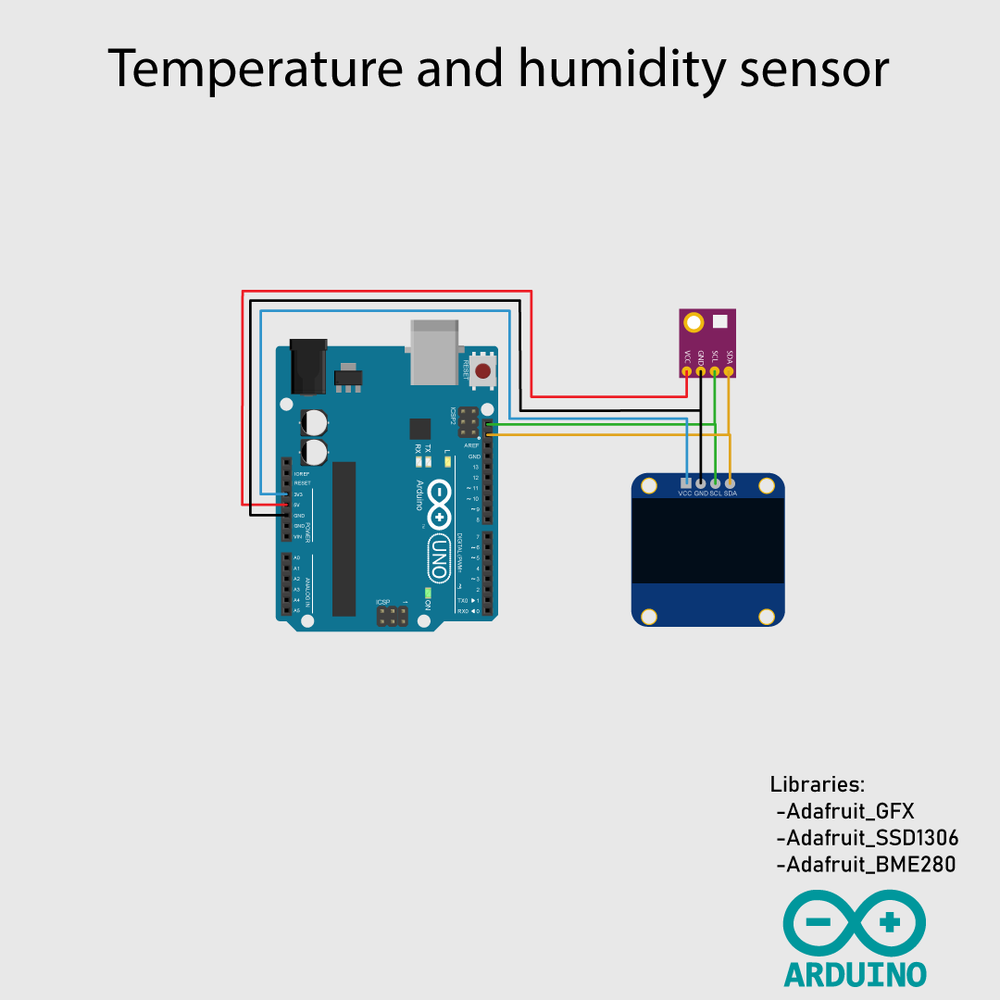
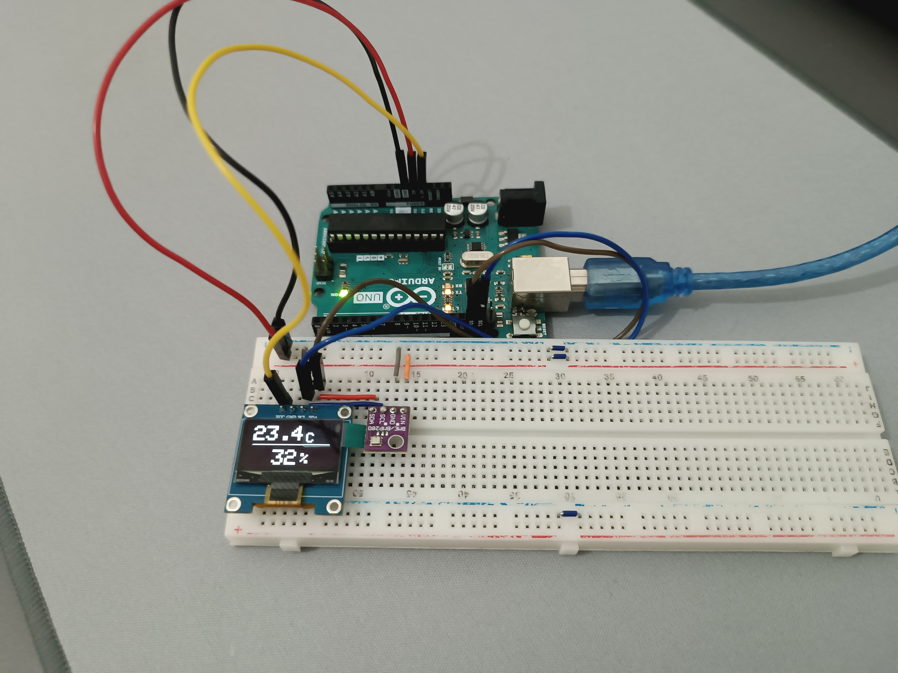

# Description
This repo is focus in create a system that:
* Measure temperature
* Measure humidity
* Show values in OLED

It uses Arduino IDE as programming environment
## Hardware Requirements
- Arduino UNO R3 (or any other board with enough pins)
- BME280 sensor for measure temperature and humidity
- OLED 0,96 " module
- Jumper wires
- External battery
## Software Requirements
- Arduino IDE installed on your computer
- Librarys needed by the code, you can install from arduino IDE
    - Adafruit_GFX
    - Adafruit_SSD1306
    - Adafruit_BME280

# Diagraman connetions

# Prototype

# Guide
To execute this software follow these steps:
1. Download or clone this repository to your local machine.
2. Open the [`temp_hum_sensor_OLED.ino`](/temp_hum_sensor_OLED/temp_hum_sensor_OLED.ino) inside Arduino IDE
3. Compile and flash [`temp_hum_sensor_OLED.ino`](/temp_hum_sensor_OLED/temp_hum_sensor_OLED.ino)

